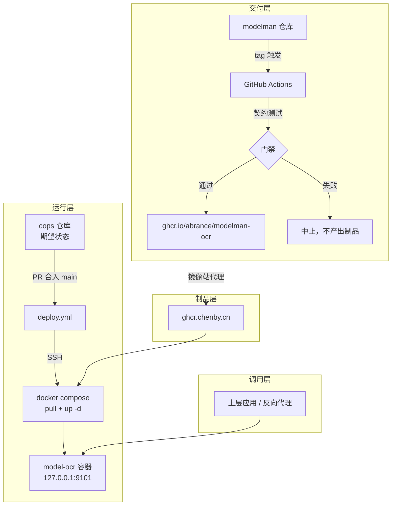

# 系统设计

本页是系统级设计：解决什么问题、受什么约束、分成哪几层、关键决策及其代价。
仓库内的落地约定（目录职责、分层要求、与 cops 的边界）见 `architecture.md`；
每个服务的接口与用法见对应 `services/<name>/README.md`。

## 要解决的问题

原先把 PP-OCR 部署到目标主机的做法是：开发机 `cargo build --release` 出约 13.5 MB 二进制，
scp 到主机，挂进一个通用的 GPU 镜像里运行，模型目录另行挂载。这套做法能跑，但有五个问题：

| 问题 | 后果 |
|---|---|
| 没有制品概念，二进制靠 scp | 改一行代码就要手工登录主机，无法回滚到"上一个版本" |
| 复用与本服务无关的基础镜像 | 运行环境不受本仓库控制，别人改那个镜像会波及本服务 |
| 没有健康检查与指标 | 部署完成与否靠人工 curl，故障只能事后翻日志 |
| 换模型没有回归验证 | 模型行为退化只能靠线上发现 |
| 模型文件散落在代码仓库里 | "线上跑的到底是哪个权重"不可复现 |

目标是把"上游模型上线"的边际人力压到接近零，同时不牺牲调用方兼容性与后续扩展能力。

## 目标与非目标

目标，按优先级排序：

1. 可复现交付：任意一个在跑的服务都能被唯一确定到某个镜像 digest，进而确定到某次提交与某个权重。
2. 上线人力最小：新增或更新模型不需要登录主机，不需要手工操作，只需要改一处版本号。
3. 调用方兼容：替换线上实现时，已有调用方不改代码。
4. 可观测：健康、就绪、版本、模型清单、指标、访问日志都是接口的一部分。
5. 可扩展：能容纳与 OCR 技术栈完全不同的任务（时序预测、日志聚类）。
6. 在资源受限的主机上可用：目标主机只有约 2 GiB 空闲内存。

非目标，明确不做：

- 通用模型平台：不做多租户、计费、模型市场、在线训练。
- GPU 调度：目标主机无 GPU，不为假设中的 GPU 场景预留抽象。
- 自研编排器：容器编排交给 docker compose，调度交给现有 CI。
- 替代 K8s：不在单主机上模拟 Deployment / Service / CRD 那套概念。

## 环境约束

这些约束不是背景信息，它们直接决定了后面的设计选择。

| 约束 | 实测值 | 对设计的影响 |
|---|---|---|
| 部署主机资源 | 4 核 AMD EPYC，3.6 GiB 内存（已用 1.6 GiB），31 GiB 可用磁盘，无 GPU | 必须压内存占用；必须给并发设上界；必须显式设置线程数，不能留给运行时按核数推导 |
| 主机上的邻居 | lems、emsdevice、ptcdoc、qdrant、traefik、postgres 同机 | 资源限额与日志轮转是必需品，不是优化 |
| 境内网络 | 禁止直连 `ghcr.io`，走 `ghcr.chenby.cn`，备选 `ghcr.nju.edu.cn` | 镜像 tag 必须不可覆盖（镜像站按 tag 缓存，覆盖后会拿到陈旧层） |
| 构建环境 | GitHub 托管 runner：14 GB SSD，无 GPU，公开仓库 4 核 | 镜像不能只有"运行期才下载权重"的路径，构建必须在 runner 上可完成 |
| 制品仓库 | GHCR 单层 10 GB 上限、上传 10 分钟超时；公开包免费，私有包与 Actions artifacts 共享小额度 | 单层要控制在数 GB 内；包设为公开，避免额度与拉取凭据问题 |
| 端口 | 11000 / 1502 / 4173 / 8081 / 9090 等已占用 | 模型服务统一使用 91xx 段 |

由此推出的三条硬性结论：

1. **权重必须随镜像交付。** 构建机可以访问外网，运行主机不保证可以；运行期下载会让冷启动时间不可预测，也让"这个容器跑的是哪个权重"不可复现。
2. **镜像 tag 必须不可变。** tag 形如 `<版本>-<提交短 sha>`，永不覆盖。
3. **CPU 优先，并发收敛。** 小模型在 CPU 上的性价比高于把请求排到 GPU；并发上限默认 2。

## 分层

| 层 | 职责 | 明确不做 |
|---|---|---|
| 交付层 | 编译、测试、构建镜像、发布 | 不做部署，不持有主机的任何凭据 |
| 制品层 | 存放不可变镜像 | 不做缓存策略以外的逻辑；镜像站的缓存行为是"必须假设 tag 不可覆盖"的原因 |
| 运行层 | 保存期望状态并施加到主机 | 不写模型逻辑，不编译代码 |
| 调用层 | 调用服务 | 不在本仓库范围内；入口的 TLS 与域名反代由主机上的 traefik 负责 |

## 关键选型与理由

### 为什么不用现成的 LLM 推理框架

候选是 vLLM、TGI、TEI、BentoML、Triton、TorchServe。它们的定位与本任务不匹配：

| 框架 | 不适用的原因 |
|---|---|
| vLLM / TGI / TEI | 只覆盖文本生成与向量化，OCR 这类"图像进、结构化文本出"的任务不在其模型类别里 |
| Triton | 每个模型要写 `config.pbtxt` 与后端，配置人力与"降低人力"的目标直接冲突 |
| TorchServe | 生态停滞，抽象层厚于收益 |
| BentoML | 能做，但依赖 Python 生态与自身打包约定；OCR 的推理栈是 MNN 的 C++ 绑定，走 Python 反而更绕 |

对应到本仓库：视觉类小模型走「Rust 服务 + MNN」，权重的形态是 `.mnn` 文件，
不需要模型注册中心与动态加载那一层。

### 为什么是双技术栈

不同任务的性价比最优解不同，强行统一只会付出性能代价：

| 任务类型 | 技术栈 | 理由 |
|---|---|---|
| 视觉类小模型（OCR、目标检测、分类） | Rust + MNN / ONNX Runtime | 传统小模型在 CPU 上比 Transformer 快一到两个数量级，权重体积小一到两个数量级；实测 PP-OCRv6 small 单张 5–20 ms、权重 15 MB，而 TrOCR 一类单张数百毫秒、权重 1 GB 以上 |
| 时序预测、文本类 | Python + transformers / ONNX Runtime | 上游权重是 HuggingFace 格式，Python 生态的加载与预处理更成熟 |

两条栈共享同一套交付约定（镜像、标签、接口契约、契约测试），差异只在容器内部。

### 其他决策

| 决策 | 选择的理由 | 代价 |
|---|---|---|
| 单仓库而非"基础镜像仓库 + 服务仓库" | 权重几十 MB 级，代码与权重必须同时变化才可复现；拆开引入跨仓库版本对齐问题，而 cops 只关心镜像 tag，不关心仓库划分 | 基础依赖升级会牵动所有服务重建（用 path filter 与目录哈希 tag 缓解） |
| 一个服务一个镜像 | 层可复用、可独立回滚、资源上限可按服务设置 | 同机多服务时基础层重复占盘（当前每服务约 133 MB，可接受） |
| 权重直接烘进镜像 | 构建期一次解决，运行期不依赖外网，可复现 | 换权重需要重建镜像；对小于几十 MB 的模型这个代价可忽略 |
| 默认不编译 Vulkan | 实测 CPU 5–20 ms、Vulkan 30–75 ms；同时省掉 libvulkan 运行时依赖与脆弱的静态初始化符号链接 | 失去 GPU 路径；`backend=gpu` 返回明确的 400 而不是静默变慢 |
| MNN 使用上游预编译归档 | 启用 `build-mnn-from-source` 或任一后端 feature 都会退化为从源码编译 MNN，单次构建十几分钟；预编译归档是同一版本，只需一次下载 | 依赖上游 release 的可用性；可用 `MNN_SOURCE_DIR` 指向本地检出兜底 |
| 契约测试用相似度而非精确相等 | 阈值以下一行之差不应让构建失败，但结构性退化必须拦住 | 需要维护基线并人工 review 基线变更 |

## 服务契约

所有服务必须实现下列端点，字段名与语义保持一致，部署链路与运维工具据此统一处理。

| 端点 | 语义 | 鉴权 |
|---|---|---|
| `GET /livez` | 进程存活 | 否 |
| `GET /healthz` | 存活 + 已加载模型 + 运行时长；容器健康检查用 | 否 |
| `GET /readyz` | 默认模型已常驻、可以接流量；否则 503 | 否 |
| `GET /version` | 版本、git 提交、构建时间、生效配置 | 否 |
| `GET /models` | 可用模型清单、加载状态、加载失败原因 | 否 |
| `GET /metrics` | Prometheus 文本格式 | 是 |
| 业务端点 | JSON 请求/响应，错误响应含可读原因 | 是 |

错误码约定（区别于前置实现的"一律 500"）：

| 情况 | 状态码 |
|---|---|
| 请求体格式错误、参数非法、模型名不存在 | 400 |
| 未携带或携带错误 token | 401 |
| 服务过载、等待槽位超时 | 503 |
| 加载失败、推理内部错误 | 500 |

健康检查端点刻意不做鉴权，使容器能在注入凭据之前就通过探活。

配置一律走环境变量，且只在一个模块里解析，便于测试时直接构造配置结构体。
默认值必须能在开发机上开箱跑通。

可观测性由三部分组成：结构化日志（启动配置、模型加载、请求访问）、Prometheus 指标
（请求计数与延迟直方图按档位打标签）、以及 `/version` 与 `/models` 这类可直接 curl 的状态接口。

## 质量保障

模型服务与普通服务最重要的差别是：编译通过不代表行为没退化。因此引入契约测试。

机制：

1. `tests/fixtures/` 存放固定样本与基线文件，基线记录逐行识别文本、置信度、原始检测行数、延迟。
2. 测试逐样本比对：识别行数必须一致、文本相似度必须达到阈值、原始检测行数必须一致（否则说明检测阶段变了）。
3. 汇总层再检查 p95 延迟不出现量级退化（阈值放得很宽，用于捕捉数量级退化而非抖动）。
4. 基线只能通过专用生成程序更新，且必须人工 review 差异——改基线等于改验收标准。

门禁位置有两处，且不重复：CI 在每次 PR 运行，发布 workflow 在推镜像之前再运行一次。
后者是必须的，因为镜像一旦推送就可能被部署仓库引用。

## 决策记录

按时间顺序记录已经落地的决策，便于日后回答"为什么当初这么定"。

| 编号 | 决策 | 理由 | 状态 |
|---|---|---|---|
| D1 | 新仓库与服务代码同仓，权重随镜像 | 可复现性优先于仓库解耦 | 已落地 |
| D2 | 一个服务一个镜像，一个镜像只含一个服务 | 层复用、独立回滚、独立限额 | 已落地 |
| D3 | 默认不编译 Vulkan，`backend=gpu` 返回 400 | 实测 CPU 更快，且省掉运行时依赖 | 已落地 |
| D4 | 不交付 PP-OCRv6 medium | 该权重在 MNN 中加载失败，上游工具同样复现 | 已落地（原因记入 `registry/ocr.yaml`） |
| D5 | 镜像 tag 形如 `<版本>-<提交短 sha>`，不可覆盖 | 境内镜像站按 tag 缓存 | 已落地 |
| D6 | 用户提交图像必须过解码限制 | 畸形或超大输入可打爆内存 | 已落地 |
| D7 | 推理放阻塞线程，锁粒度到单个引擎 | 前置实现用一把全局锁串行化所有请求，连健康检查都会被挡住 | 已落地 |
| D8 | 并发由信号量设上界，超时返回 503 | 主机 4 核且与邻居共享，排队优于拒绝但不允许无界排队 | 已落地 |
| D9 | 默认只绑 `127.0.0.1`，公网入口交给主机反向代理 | 服务没有账号体系，绑 `0.0.0.0` 等于公开 | 已落地 |
| D10 | 访问日志用 `tower_http=debug` 打开 | `RUST_LOG=ocr_service=info` 会把访问日志整体过滤掉，属能力回退 | 已落地（后续计划提到 INFO，见 `roadmap.md`） |
| D11 | 超过阈值的低置信行丢弃，阈值默认 0.3 | 与前置实现保持一致，避免替换时调用方观察到输出变化 | 已落地 |
| D12 | 服务构建入口下沉到 `services/<name>/service.mk`，CI 按目录发现服务 | 加一个服务不应改根 `Makefile` 与 CI；技术栈差异（Rust / Python）只影响服务目录内部，不影响交付链路口径 | 已落地 |
| D13 | 有状态服务（日志聚类）的状态独立于镜像，带 schema 与参数校验；不兼容时降级为 `/readyz` 503 且不覆盖旧状态 | 镜像回滚无法回滚累积状态。静默从空树开始会让输出惄惄变化，直接退出则只能看日志；降级能同时做到“不服务坏状态”与“能用 HTTP 看到原因” | 已落地（`services/logcluster`） |

## 已知风险

| 风险 | 影响 | 现状 |
|---|---|---|
| 服务无鉴权，且即将位于反向代理之后 | 入口一旦对公网开放，等于免费对外开放 CPU 密集型接口 | 当前只绑回环，未暴露；开放前必须先加 `AUTH_TOKEN` |
| 单主机单副本，无冗余 | 主机故障即服务不可用 | 可接受；回滚依赖重新拉取镜像（默认回收窗口 120 小时） |
| 契约测试样本集固定且规模小（20 张） | 对样本外的输入分布无保障 | 模型变更时靠它拦回归；样本集应随实际场景扩充 |
| 目标主机内存余量小 | 同时常驻多个模型服务不可行 | 见 `roadmap.md` 的资源规划项 |
| 上游预编译 MNN 归档依赖 GitHub release | 上游不可达时构建失败 | 可用 `MNN_SOURCE_DIR` 指向本地检出兜底 |
| 有状态服务（日志聚类）的状态不在镜像里 | 回滚镜像不会回滚状态；参数变更或状态损坏后需要人工处理 | 用 schema/profile 校验 + 降级 + 不覆盖旧状态兜住，见 `services/logcluster/README.md` 与 `docs/deployment.md` |
